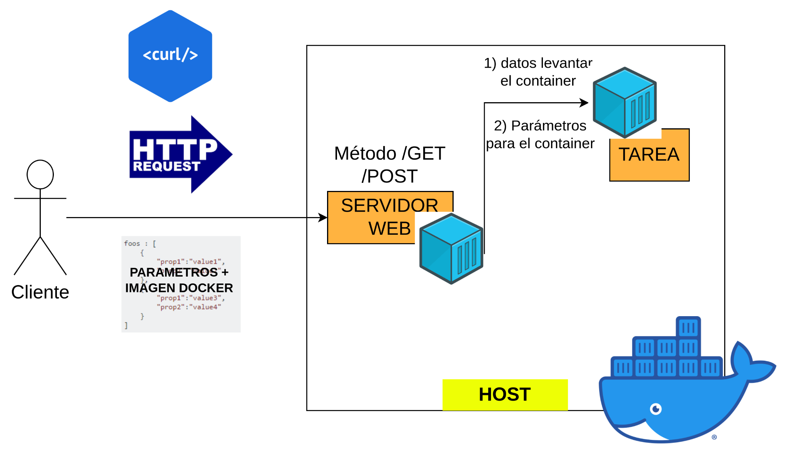

# Descripción de los ejercicios del Trabajo Práctico 2

## Hit #1

Implemente un servidor que resuelva “tareas genéricas” o “pre-compiladas”. Para ello, hay un conjunto de acciones de diseño y arquitectura que deben respetarse:

- **Servidor:**
  - Desarrollar el servidor utilizando tecnología HTTP.
  - El servidor debe ser contenerizado y alojado en un host con Docker instalado.
  - Permanecerá receptivo a nuevas solicitudes del cliente, exponiendo métodos para interactuar.
  - Debe incluir un método llamado ejecutarTareaRemota() asociado a un endpoint (getRemoteTask()) para procesar tareas genéricas enviadas por el cliente.
  - Los parámetros de las tareas serán recibidos a través de solicitudes HTTP GET/POST, utilizando una estructura JSON.
  - Durante la ejecución, el servidor levantará temporalmente un "servicio tarea" como un contenedor Docker.
  - Una vez en funcionamiento, se comunicará con el "servicio tarea" para ejecutar la tarea con los parámetros proporcionados.
  - Esperará los resultados de la tarea y los enviará de vuelta al cliente.
- **Servicio Tarea:**
  - Establecer un servicio de escucha utilizando un servidor web.
  - Implementar la tarea de procesamiento denominada ```ejecutarTarea()```.
  - Configurar el servicio para recibir los parámetros de entrada en formato JSON.
  - Empaquetar la solución como una imagen Docker para facilitar la distribución y el despliegue.
  - Publicar la solución en el registro de Docker Hub, ya sea público o privado, para que esté disponible para su uso y colaboración.
- **Cliente:**
  - Utilizar una solicitud HTTP GET/POST para comunicarse con el servidor.
  - Enviar los parámetros necesarios para la tarea en formato JSON, incluyendo:
  - El cálculo a realizar.
  - Los parámetros específicos requeridos para la tarea.
  - Datos adicionales necesarios para el procesamiento.
  - La imagen Docker que contiene la solución de la tarea.
  - Credenciales de usuario y contraseña encriptadas en caso de que se trate de un registro privado en Docker Hub.


Diagrama de arquitectura inicial para la solución de tareas genéricas. Fuente: Propia.

## Resolución : Server

- ```TaskController```: se encarga de manejar las solicitudes entrantes al endpoint mediante un método ```/getRemoteTask``` mediante el método HTTP ```POST```. Su principal función es recibir una operación matemática encapsulada en un objeto ```Task```, que contiene el tipo de operación, dos parámetros numéricos, y el nombre de una imagen Docker que implementa el servicio encargado de realizar dicha operación.
- ```ErrorDTO```: se encarga de representar errores de forma estructurada dentro del sistema. Funciona como un **Data Transfer Object (DTO)**, permitiendo encapsular los detalles de un error en un objeto claro y organizado que pueda ser retornado al cliente. Contiene campos como el mensaje de error, un código identificador, un timestamp que indica el momento en que ocurrió el error, información detallada adicional y la ruta del endpoint que generó el problema. Este enfoque mejora la claridad de los errores devueltos y facilita el manejo de fallos en el lado del cliente.
- **```ErrorDTOValidaciones```**: hereda de ```ErrorDTO``` y está diseñada específicamente para representar errores de validación.
- **```TaskRequestDto```**: representa el cuerpo de una solicitud entrante que describe una operación matemática que el sistema debe resolver. Contiene tres atributos: el tipo de operación (por ejemplo, suma o multiplicación) y dos parámetros numéricos (parameter1 y parameter2) que actuarán como operandos.
- **```GlobalExceptionHandler```**: es una clase anotada con @RestControllerAdvice, lo que permite capturar excepciones de forma centralizada en todo el backend. Implementa métodos para manejar distintos tipos de errores comunes en las solicitudes HTTP.
- **```Task```**: Contiene cuatro atributos, la operación a realizar, dos parámetros numéricos y el nombre de la imagen Docker que ejecutará la lógica. A diferencia de ```TaskRequestDto```, esta clase aplica anotaciones de validación como ```@NotBlank``` y ```@NotNull``` para asegurar que los datos recibidos sean correctos antes de procesarlos.
- **```TaskResponse```**: define la estructura de la respuesta que el servidor devuelve al cliente luego de resolver una operación. Tiene dos atributos: ```operation```, que representa la operación ejecutada, y ```result```, que almacena el resultado numérico de la misma.
- **```ServerApplication```**: es la clase principal del backend construido con Spring Boot. Contiene el método ```main()``` que se encarga de iniciar toda la aplicación. Al estar anotada con ```@SpringBootApplication```, esta clase activa la configuración automática, el escaneo de componentes y otras funcionalidades clave de Spring.

## Resolución : TaskServer

- **```TaskController```**: es el controlador principal del servidor de tareas que expone endpoints HTTP para recibir y procesar solicitudes. Está anotada con @RestController, lo que permite que Spring maneje automáticamente la serialización de objetos Java a JSON en las respuestas.
- **```TaskRequest```**: representa el modelo de datos que recibe el servidor al ejecutar una tarea. Contiene tres atributos: ```operation```, que define la operación matemática a realizar, y ```parameter1``` y ```parameter2```, que son los operandos.
- **```TaskResponse```**: representa la estructura de la respuesta enviada al cliente una vez que la operación ha sido procesada. Posee dos atributos: ```operation```, que indica el tipo de operación realizada, y ```result```, que contiene el resultado numérico.
- **```TaskServerApplication```**: es la clase principal del servidor de tareas construido con Spring Boot. Al estar anotada con ```@SpringBootApplication```, se encarga de activar la configuración automática, el escaneo de componentes y la inicialización de todo el contexto de Spring. El método principal se encarga de ejecutar la aplicación, iniciando el servidor HTTP que estará preparado para recibir y resolver tareas matemáticas según lo definido en ```TaskController```.

## Para realizar pruebas

Clonar el tag del tp2 de nuestro repositorio git.

```git
git clone --branch tp2 --depth 1 https://github.com/martinlopez05/SD-2025-Trabajos-Practicos TP2
```

Nos situamos dentro de la carpeta para poder ejecutar el archivo docker

```git
cd .\TP2\tp2\Server\Server\
```

Levantamos el contenedor de docker con:

```git
docker-compose up --build
```

Decargamos la imagen:

```git
docker pull martinlopez05/taskserver:v1
```

Para hacer una prueba podríamos utilizar:

Para Windows:

```git
$headers = @{
    "Content-Type" = "application/json"
}

$body = @{
    operation = "suma"
    parameter1 = 100
    parameter2 = 100
    dockerImage = "martinlopez05/taskserver:v1"
} | ConvertTo-Json

Invoke-WebRequest -Uri "http://localhost:8080/getRemoteTask" -Method POST -Headers $headers -Body $body
```

Para Linux:

```git
curl -X POST http://localhost:8080/getRemoteTask \
  -H "Content-Type: application/json" \
  -d '{
    "operation": "suma",
    "parameter1": 100,
    "parameter2": 100,
    "dockerImage": "martinlopez05/taskserver:v1"
}'
```

Se pueden realizar prubeas cambiando el ```operation``` con: resta, division, producto y cambiando el valor de cada uno de los parámetros.
